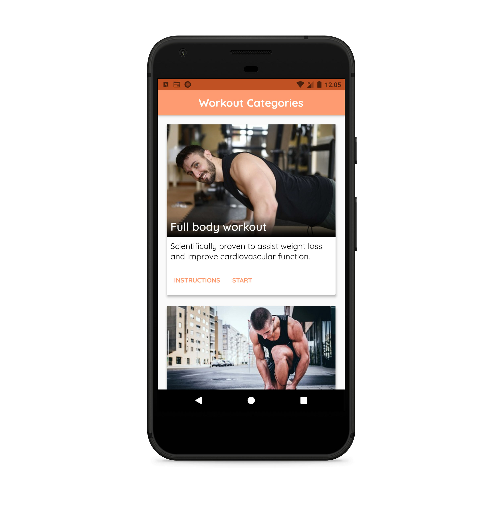
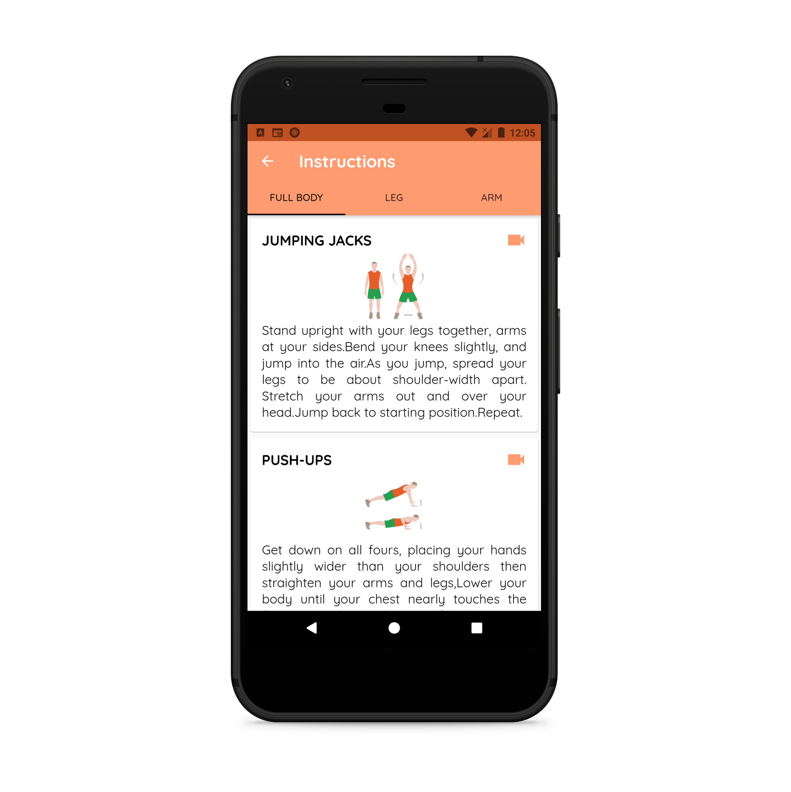
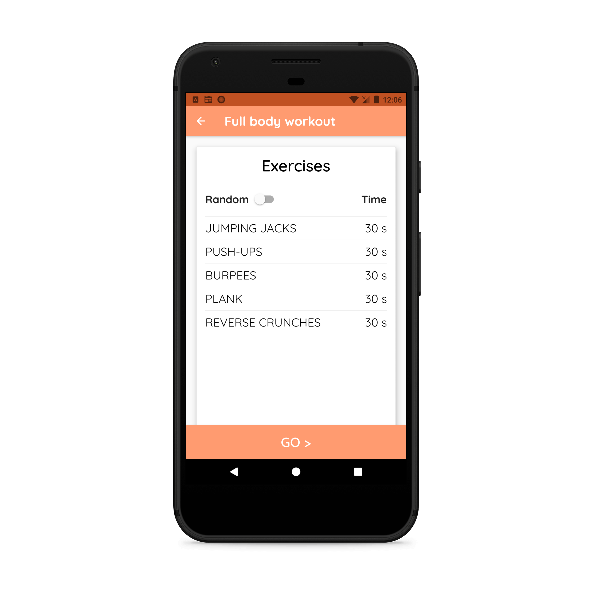
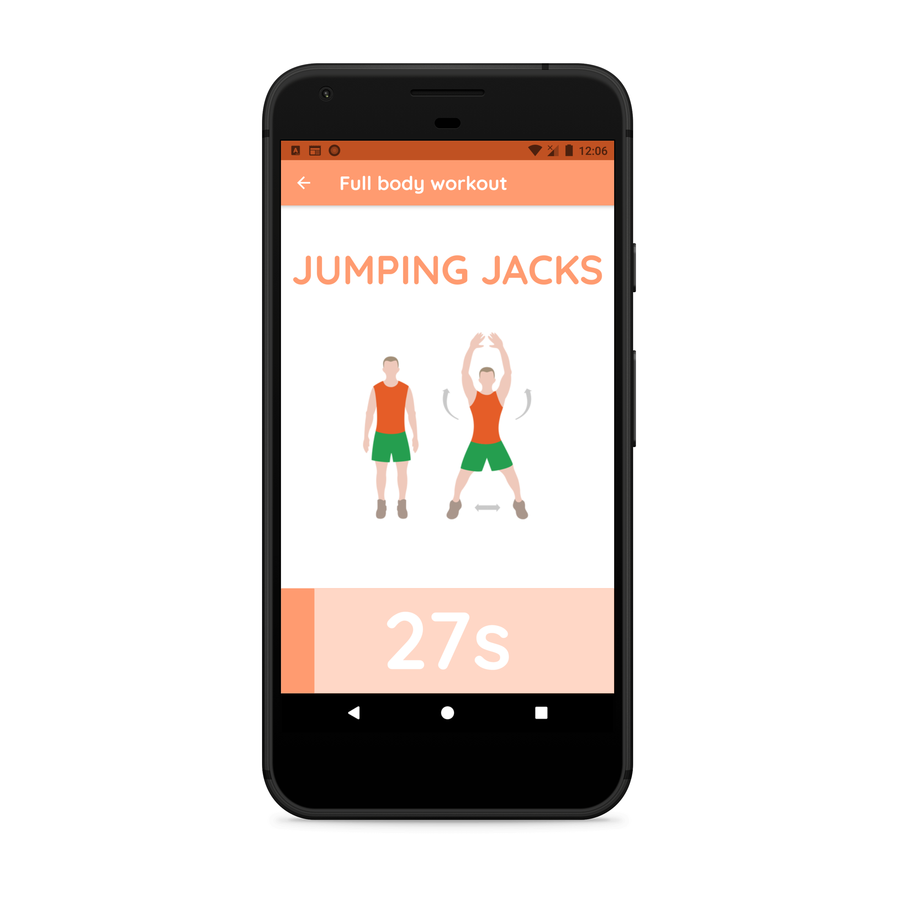

<strong>CaFit Home Workout app with Flutter:</strong>

&nbsp;

<ul>
<li>App built with Flutter using provider architecture for state management with MVVM.</li>
</ul>

&nbsp;

<strong>Steps to use the Code:</strong>

1 &ndash; Star ⭐ and clone the repo.

2 &ndash; Download the source code.

3 &ndash; Extract the code and open it with VSCode or Android studio.

4 - Get all the packages and run the app.

For projects, contact me at my email account: <strong>musabapps2019@gmail.com</strong>

<strong>App Screenshots:</strong>&nbsp;

